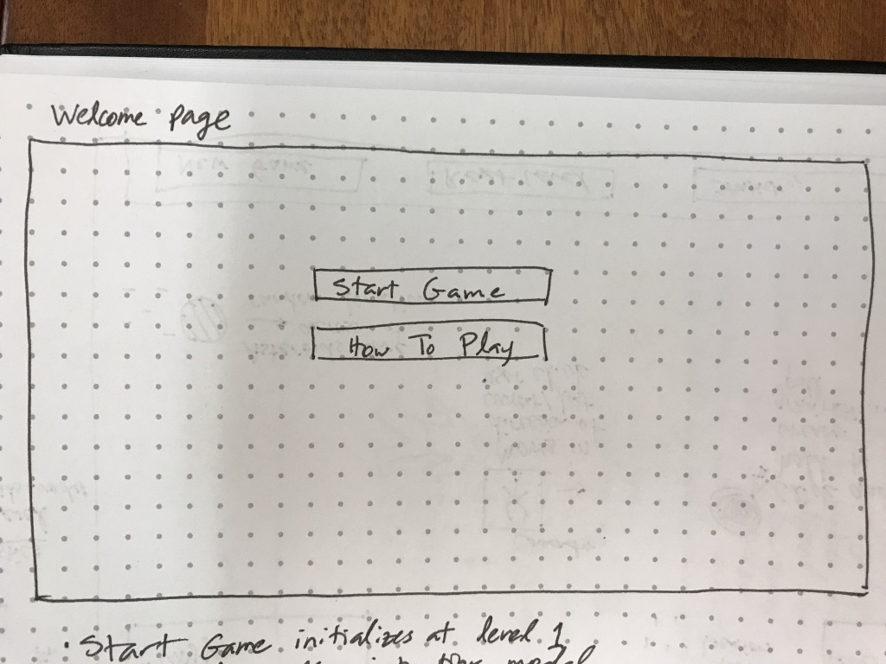
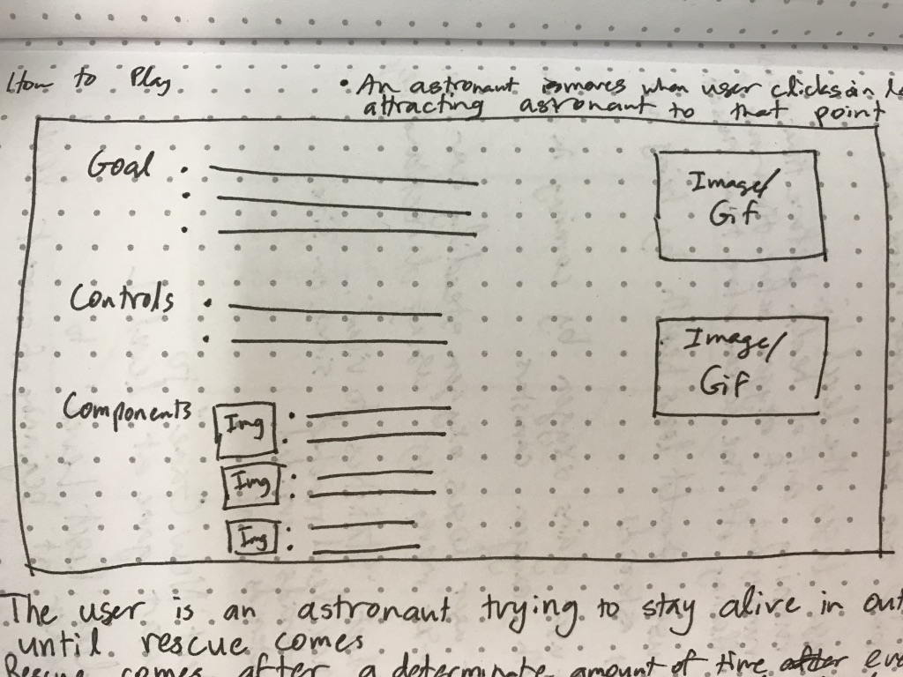
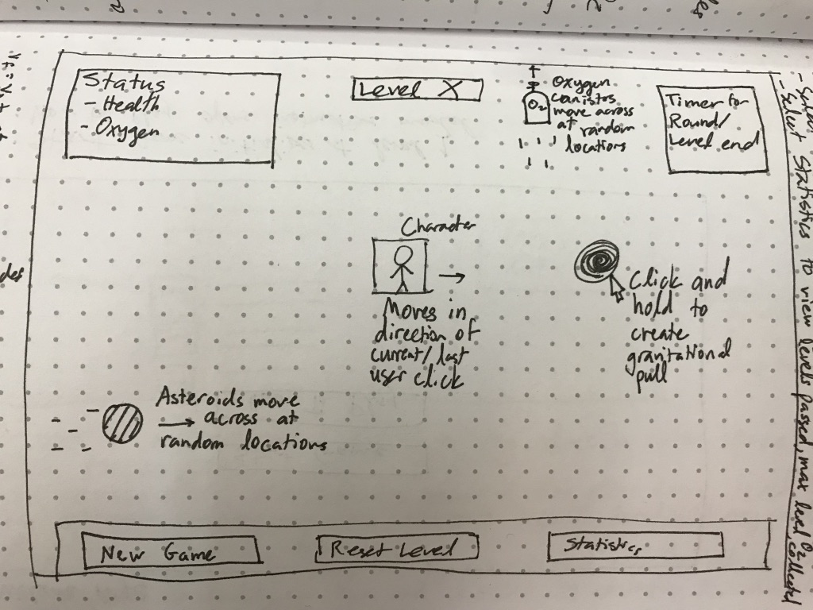
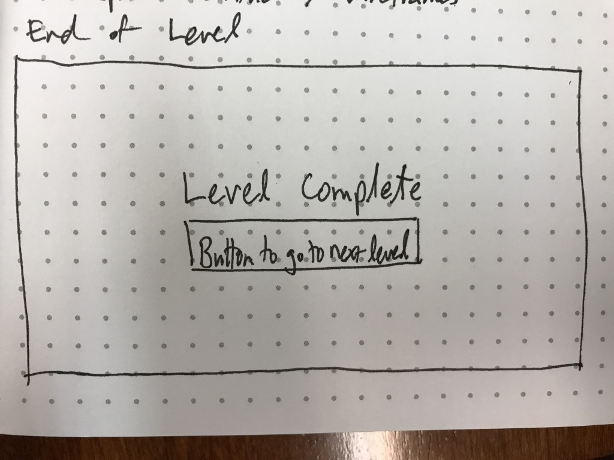

# Astrofloat
**Your Mission:** Keep the astronaut alive until interstellar help arrives.
## To-Do Items 

1. something
2. something else

## User Stories
### Main Goals
#### A user should be able to:
1. View instructions by clicking *How to Play*
2. Start the game by clicking *Start Game*
3. Once the game starts:
	* Reach next level by surviving until the timer runs out
	* Click *New Game* to start the game from Level 1
	* Click *Restart Level* to start the current level again
	
		
#### A user should be able to:
1. Win the level by surviving until the timer runs out
2. Lose the level by:
	* Completely running out of health
	* Depleting all oxygen
	* Floating off the screen area
3. Lose health by being struck by asteroids
4. Lose oxygen steadily over time
5. Restore oxygen by collecting oxygen containers
6. Control the astronaut's motion using arrow keys
7. Start each level with:
	* A full health meter
	* A full oxygen meter
	* Faster and more frequent asteroids

### Bonuses (Stretch Goals)
#### A user should be able to:
1. Click and hold with mouse to create gravitational wells that:
	* Attract the astronaut to the clicked mouse
	* Set acceleration rate relative to distance between astronaut and well
2. Avoid additional dangers:
	* Comets that are slightly attracted astronaut's path 
3. Only use arrow keys to move when a floating jetpack item is collected
4. Play the game on a mobile device
5. Click *Statistics* to view:
		- Maximum level reached across all games
		- Asteroids avoided in current game
		- Asteroids hit in current game

## Wireframes
#### Welcome Page

This is the screen the user sees when first opening the app.

#### How to Play

These are the gameplay instructions and controls.

#### Gameplay

This is the screen that the players sees while gameplay is happening. Note: The click-and-hold is a screen goal, default movement is by directional keys.

#### Level Complete

Seen at the completion of a level (with timer going to zero)

## Development
### Technology
This game was built using the following technologies:

* HTML
* CSS
* JavaScript
* Anime.js (Animation)

### Architecture
The basis of the code architecture is the Game class, an instance of which controls the flow of the game from the very start, through each round, until the game is over. Each moving component is an extension of the Mass class, providing basic position and dimension characteristics. The Mass class is extended into the Person class (representing the astronaut) and the Projectile class (representing all other flying objects). The Asteroid, Medic, and Oxygen classes are all extended from Projectile, which provides the random path generation and motion.

### Open Items
The main open item is motion of the astronaut based on clicking and holding a part of the screen to create a black hole that the astronaut is attracted to based on the distance between them. I hoped to accomplish this because it adds an element of complexity as well as making the game touch-screen enabled.

The bottom row of buttons are also not finished due to time constraints.

### Challenges
The first main challenge was figuring out which library to use to assist with animation. I looked into Paper.js at first, since I've seen it used elsewhere and liked the performance, however I did not want to spend too much time integrating the canvas element with my other div and section elements that make up the majority of the application. For the sake of time and complexity, I chose Anime.js.

Anime.js was easy to install and implement, however there was an initial challenge of smoothing out the motion of the astronaut. Since the astronaut is being controlled with arrow keys, the default easing and duration of animations did not integrate well with the user being able to move the astronaut back and forth very quickly. Setting duration to at or near zero, as well as adjusting the easing settings, solved this issue. 